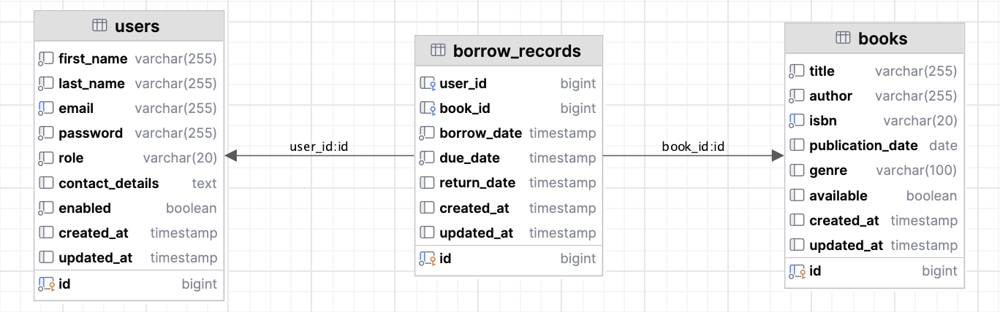

# 📚 Library Management System - Getir Bootcamp Final Project

This project is a **Spring Boot-based RESTful API** designed to handle **library management** operations. The application allows users to register, borrow books, and librarians to manage the library inventory. Key features include:

- **User Management**: Registration, authentication, and role-based access control (Patrons and Librarians).
- **Book Management**: Comprehensive book catalog with search functionality.
- **Borrowing System**: Book borrowing, returns, and overdue tracking.
- **Security**: JWT-based authentication and authorization.
- **Exception Handling**: Custom error responses ensure robustness.

## Technology Stack

- **Backend**: Java 21, Spring Boot 3
- **Database**: 
  - Development: H2 in-memory database
  - Production: PostgreSQL
- **Security**: Spring Security with JWT authentication
- **Documentation**: Swagger/OpenAPI
- **Build Tool**: Maven
- **Containerization**: Docker, Docker Compose
- **Migration**: Flyway for database migrations
- **Testing**: JUnit, Mockito
- **Logging**: SLF4J

## Try with Postman

You can test the API endpoints with [Postman](https://documenter.getpostman.com/view/21670108/2sB2qUmPZH).

## How to Use

### Clone the Repository

To start working with this project, you'll need to clone the repository to your local machine. Use the following commands to download the project and navigate into its directory:

```bash
git clone https://github.com/barisdalyan/getir-bootcamp-final-case.git
cd getir-bootcamp-final-case/library-management
```

### Configure Environment Variables

Create a `.env` file in the project root with the following configuration:

```
# Database Configuration
# Development (H2) credentials
H2_URL=jdbc:h2:mem:librarydb
H2_USER=sa
H2_PASSWORD=password

# Production (PostgreSQL) credentials
POSTGRES_URL=jdbc:postgresql://postgres:5432/librarydb
POSTGRES_DB=librarydb
POSTGRES_USER=postgres
POSTGRES_PASSWORD=postgres

# Admin Credentials
ADMIN_FIRST_NAME=Jane
ADMIN_LAST_NAME=Doe
ADMIN_EMAIL=admin@library.com
ADMIN_PASSWORD=admin123

# JWT Configuration
JWT_SECRET=SGVsbG9UaGlzSXNNeVNpZ25pbmdTZWNyZXRGb3JMaWJyYXJ5TWFuYWdlbWVudEFwcGxpY2F0aW9u
JWT_EXPIRATION=86400000
```

> **Note:** The application is configured to use H2 in-memory database for development and PostgreSQL for production environments.

## Running the Application

### Development Mode (Local)

To run the application in development mode using the H2 in-memory database:

```bash
./mvnw spring-boot:run -Dspring.profiles.active=dev
```

This will start the application on port 8080 with the H2 database.

### Production Mode with Docker

Follow these steps to build and run the application in production mode:

#### Step 1: Build the Application

First, build the application from the root directory:

```bash
cd library-management/
./mvnw clean package
```

This command will clean any previous builds, compile the code, and place the .jar file in the target folder.

#### Step 2: Build Docker Images

Next, build the Docker images defined in the docker-compose.yml file:

```bash
cd ..
docker-compose build
```

#### Step 3: Start the Application

Finally, start all services in detached mode:

```bash
docker-compose up -d
```

This command will start both the PostgreSQL database and the application services as defined in the docker-compose.yml file.

#### Stop the Project

To stop the project and remove containers and associated resources, use:

```bash
docker-compose down
```

## API Documentation

The API is documented using Swagger UI and can be accessed at `/swagger-ui/index.html` when the application is running. This provides an interactive interface to explore and test all API endpoints.

### Authentication Service ([AuthController.java](src/main/java/com/barisdalyanemre/librarymanagement/controller/AuthController.java))

This service is responsible for handling user authentication and authorization.

| Method | Endpoint                     | Description                                                      |
|--------|-------------------------------|------------------------------------------------------------------|
| `POST` | `/api/v1/auth/register`       | Register a new user with PATRON role                             |
| `POST` | `/api/v1/auth/login`          | Authenticate user and return JWT token                           |
| `PUT`  | `/api/v1/auth/promote/{id}`   | Promote a user from PATRON to LIBRARIAN role (librarians only)   |

### User Management Service ([UserController.java](src/main/java/com/barisdalyanemre/librarymanagement/controller/UserController.java))

This service handles CRUD operations for user management.

| Method   | Endpoint                  | Description                         |
|----------|----------------------------|-------------------------------------|
| `GET`    | `/api/v1/users/`           | Retrieves all users (librarians only) |
| `GET`    | `/api/v1/users/{id}`       | Retrieves a single user by ID       |
| `PUT`    | `/api/v1/users/{id}`       | Updates user details by ID          |
| `DELETE` | `/api/v1/users/{id}`       | Deletes a user by ID (librarians only) |

### Book Management Service ([BookController.java](src/main/java/com/barisdalyanemre/librarymanagement/controller/BookController.java))

This service handles the management of books in the library.

| Method   | Endpoint                     | Description                         |
|----------|------------------------------|-------------------------------------|
| `POST`   | `/api/v1/books`              | Add a new book (librarians only)    |
| `GET`    | `/api/v1/books/{id}`         | Get book by ID                      |
| `GET`    | `/api/v1/books/isbn/{isbn}`  | Get book by ISBN                    |
| `GET`    | `/api/v1/books`              | Get all books with pagination       |
| `GET`    | `/api/v1/books/search`       | Search books with various criteria  |
| `PUT`    | `/api/v1/books/{id}`         | Update book details (librarians only) |
| `DELETE` | `/api/v1/books/{id}`         | Delete a book (librarians only)     |

### Book Borrowing Service ([BorrowController.java](src/main/java/com/barisdalyanemre/librarymanagement/controller/BorrowController.java))

This service handles book borrowing and returning operations.

| Method   | Endpoint                     | Description                         |
|----------|------------------------------|-------------------------------------|
| `POST`   | `/api/v1/borrow/{bookId}`    | Borrow a book                       |
| `PUT`    | `/api/v1/borrow/return/{bookId}` | Return a borrowed book          |
| `GET`    | `/api/v1/borrow/history`     | Get user's borrowing history        |
| `GET`    | `/api/v1/borrow/active`      | Get user's active loans             |
| `GET`    | `/api/v1/borrow/history/all` | Get all borrowing records (librarians only) |
| `GET`    | `/api/v1/borrow/overdue`     | Get all overdue records (librarians only) |
| `GET`    | `/api/v1/borrow/overdue/report` | Get overdue books report as text (librarians only) |

## Database Schema

<p align="center">

</p>

The application uses the following core entities:

- **User**: Represents library users with roles (PATRON or LIBRARIAN)
- **Book**: Represents books in the library inventory
- **BorrowRecord**: Tracks book borrowing history and status

## Security Features

- **JWT Authentication**: Secure authentication using JSON Web Tokens
- **Role-Based Access Control**: Different permissions for patrons and librarians
- **Password Encryption**: Secure storage of user credentials using BCrypt
- **Default Admin Account**: The system creates a default librarian account on startup using the credentials specified in the environment variables

## Additional Information

- The application includes scheduled tasks for identifying overdue books
- The system enforces borrowing limits and loan duration policies
- Comprehensive exception handling with appropriate HTTP status codes
- Pagination support for large result sets

## License

This project is released under the MIT License.
